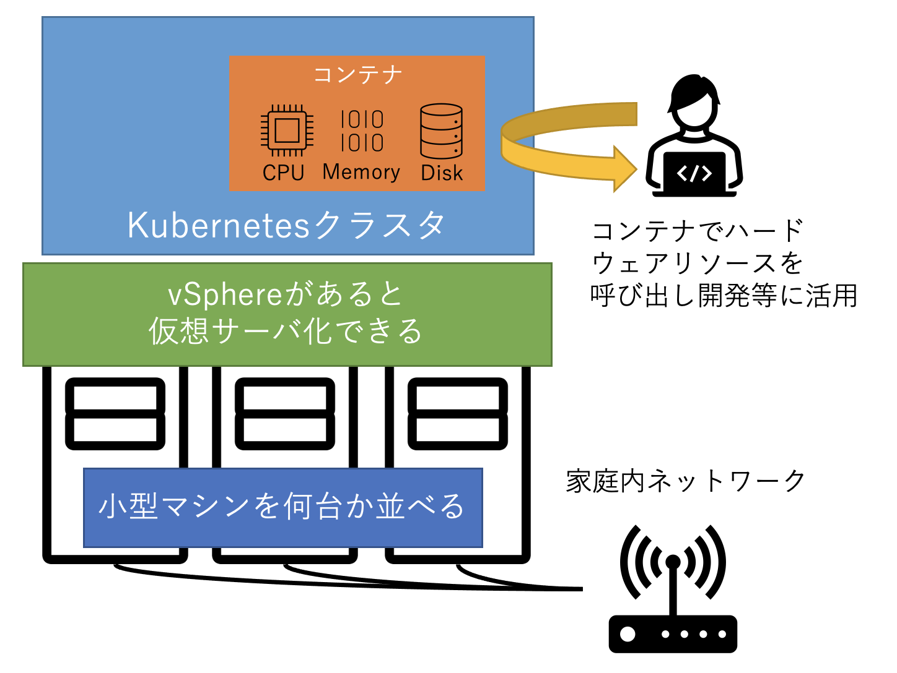
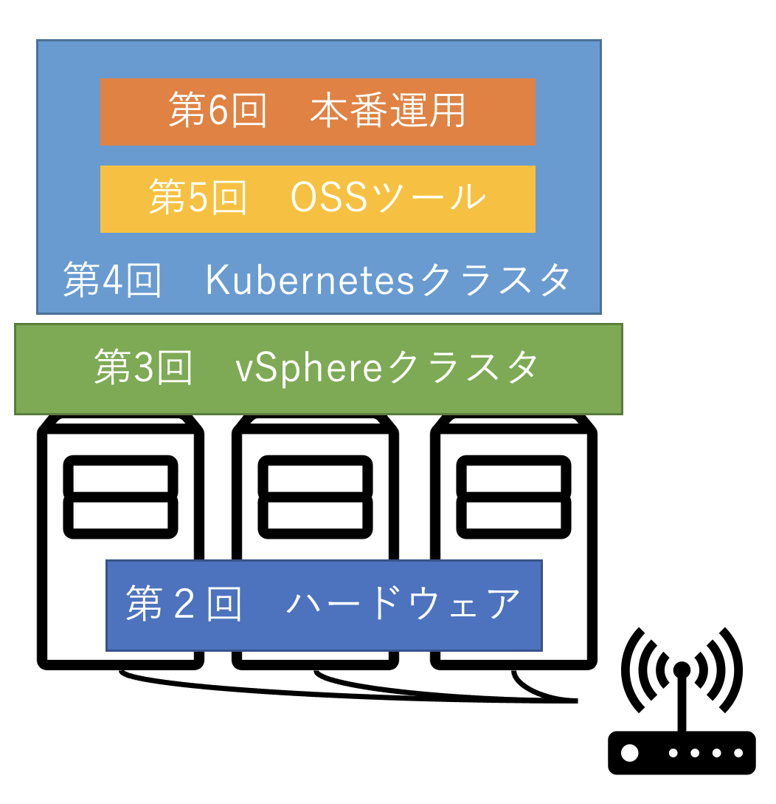

VMware x Kubernetes

# はじめよう、おうちクラウド

> 本ページは、[Software Design](https://gihyo.jp/magazine/SD) 誌 2021年11月号〜2022年4月号に掲載される連載、「(VMware x Kubernetes) **はじめよう、おうちクラウド**」に関する特集企画です。

## おうちクラウドって何？
「各ご家庭で複数のPCを用意してネットワークにつなげ、ちょっとした環境構築をすることで、コンテナ等を介してハードウェアリソースを活用できるようになった環境」のことを **おうちクラウド** と呼称いたしました。

「何故そう呼ぶか？」、「おうちクラウドのメリット」等の解説は、連載第1回(2021年11月号)に掲載しておりますので、詳しくはSD本誌をご覧下さい！

## 連載スケジュール
下記表のリンクは、本誌の発売に連動して、**各回の補足ページ**を開設予定です！

連載回(掲載号) | タイトル(仮) | 本稿担当 | コラム担当
-|-|-|-
[第1回(2021年11月号)](./vol1/README.md) |「おうちクラウド」が今熱い! | 佐藤 寛貴 | 谷垣 友喜
第2回(2021年12月号) | おうちクラウドの第一歩 〜ハードウェアを用意しよう〜  | 草間 一人 | 笠原 良太
第3回(2022年1月号) |  vSphereでインフラをたてよう | 川満 雄樹 |市川 博隆
第4回(2022年2月号) | Kubernetesクラスタを手軽に建てて増やしてみよう | 佐藤 寛貴 | 村田 一平
第5回(2022年3月号) | Kubernetesを支えるOSS | 伊藤 裕一 | --
第6回(2022年4月号) | おうちクラウドをインターネットに公開しよう | 槙 俊明 | --

## もっと知りたい！おうちクラウド (リンク集)

* [VMware DevOps Meetup #10](https://vmware.connpass.com/event/223160/) - (2021年9月22日開催) VMware主催の情報交流会。全登壇者がセッション中に各々のおうちクラウドについて語ってくれています。
  * [「おうちクラウド」が今熱い！](https://www.slideshare.net/HirotakaSato1/ss-250289370) - おうちクラウドとは何かを簡単に紹介するLT。
  * [自宅らぼ再入門　おうちクラウドのすすめ](https://www.slideshare.net/yukikawamitsu/20210922-250264836) - Intel NUC を利用して自宅で vSphere ESXi クラスタを導入するための考慮点を紹介。

* **NUCで始めるVMware Tanzu** - おうちクラウドの前身となる企画。自宅にIntel NUCを複数台購入したのをきっかけとして、それを活用したVMware Tanzuの導入方法を紹介。
  * [Qiita Advent Calender](https://qiita.com/advent-calendar/2020/nuc-vmware-tanzu) - (2020年12月1日〜25日) 一人アドベントカレンダーを決行。1日ごとに少しずつおうちクラウドができていく様子を丁寧に説明しています。
  * **CloudNative Days Spring 2021**([Slide](https://www.slideshare.net/HirotakaSato1/nucvmware-tanzu))([動画](https://event.cloudnativedays.jp/cndo2021/talks/641)) - (2021年3月12日) NUCでおうちクラウドを運用した結果、いくつか出てきた問題点と、それを解決するために購入したハードウェアについて紹介。

* [WilliamLam.com](https://williamlam.com/) - 海外では今回のおうちクラウドのような環境を作る活動が割と盛んに行われており、 **homelab** と呼ばれています。このブログの著者はその第一人者であり、vSphereやhomelabの情報が満載のため、必見です！

* [おうちクラウド ロゴキャラリー](https://assets.adobe.com/public/3cb60f7f-1f46-4157-7d5d-bb4ed49d0ad7)

## おうちクラウドについて質問したい
本レポジトリの [GitHub Issues](https://github.com/tanzu-japan/ouchi-cloud/issues) に質問を投稿していただければ、各著者がベストエフォートで回答いたします。ご意見・ご要望や、はたまた各著者のおうちクラウドパーツに関する質問でも構いませんので、ご活用下さい！