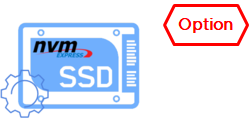
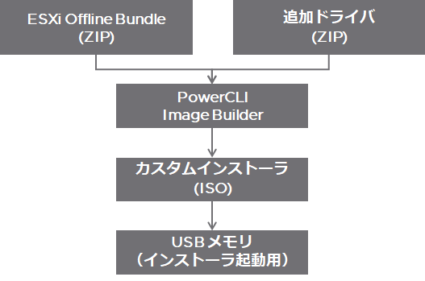
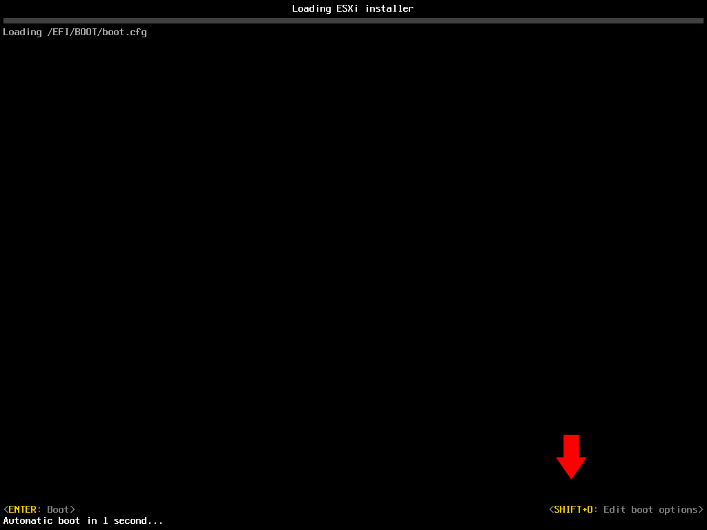
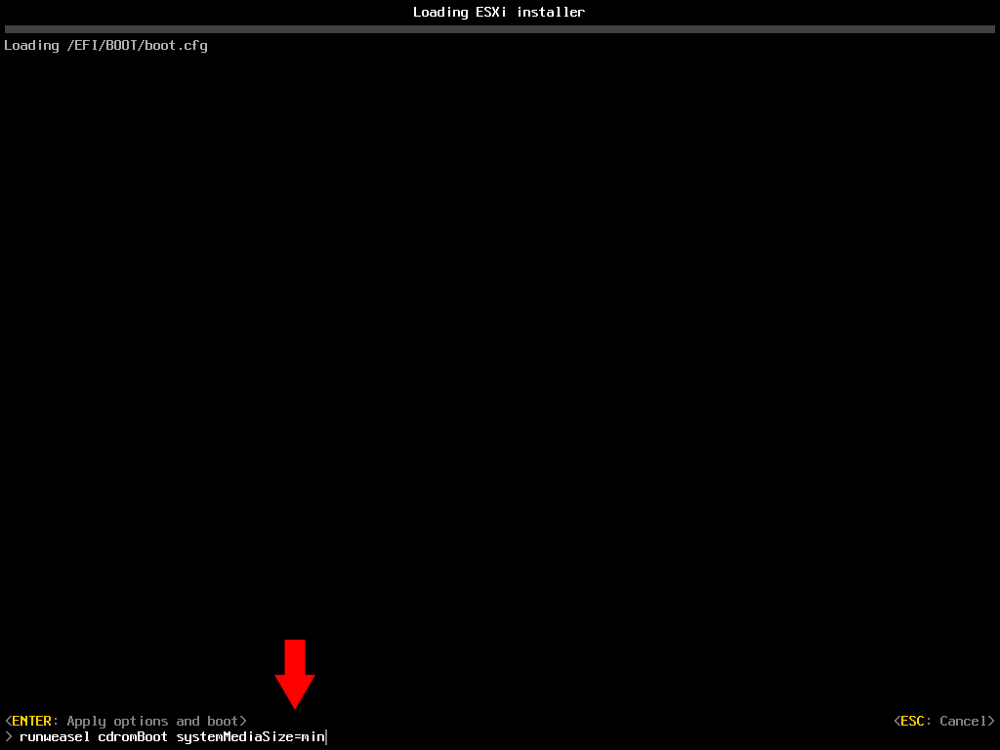

1. [メインへ](./README.md)
2. [NUC の初期設定](./01_nuc_setup.md)
3. [ESXi インストーラの作成](./02_esxi_custom_installer.md)
4. [ESXi のインストールと基本設定](./03_esxi_setup.md)
5. [vCenter のデプロイと基本設定](./04_vcenter_setup.md)
6. [Nested ESXi のデプロイ](./05_nested_esxi.md)
7. [vSphere Cluster の作成](./06_vsphere_cluster.md)
8. [自宅 vSphere らぼの Expert をご紹介](./07_expert.md)

# ESXi インストーラの作成
vSphere ESXi は VMware サポートサイトから ISO 形式のインストーラをダウンロードして、PC・サーバにインストールする事が出来ますが、
ハードウェアによってはネットワークインターフェースカード(NIC) や IO Controller のドライバを追加する必要があります。

今回の利用している Intel 第11世代 NUC はオンボード NIC の Intel i225-V は標準の ESXi インストーラにはドライバが含まれないため、個別にドライバを含めたインストーラを作成する必要があります。

ご利用のハードウェアによって標準インストーラのまま利用可能な場合もありますので、まずは標準インストーラで試してみてください。
※ カスタムインストーラの作成が必要か否かは標準 ESXi インストーラでのインストールを試してみるのが手っ取り早いです。

## ESXi のダウンロード
VMware 製品の評価版ダウンロードは [製品評価センター](https://www.vmware.com/jp/try-vmware.html) から入手可能です。
※ 評価版と通常製品版に違いはありません。

ダウンロードには [VMware Customer Connect](https://customerconnect.vmware.com/) アカウントが必要なのでお持ちでない場合は新規に作成してください。

Intel NUC 11th 用には ISO ファイルで提供されている標準の ESXi インストーラでは NIC ドライバなど必要なものが不足しているので ESXi は Offline Bundle と記載のある ZIP ファイルをダウンロードします。

VMware 製品のダウンロードに慣れている人は[製品パッチ](https://customerconnect.vmware.com/jp/patch) から入手しても構いません。

カスタムインストーラを作成しない場合は ISO 形式の標準の ESXi インストーラをダウンロードして、**[ESXiのインストールと基本設定](./03_esxi_setup.md)** へお進みください。

## コミュニティドライバの入手

VMware では [VMware Flings](https://flings.vmware.com) と呼ばれるサイトで検証ツール、製品化前のテスト段階のツールなどが公開されています。
特に、Intel NUC 11th のオンボード NIC のドライバはここで公開されているものを組み込むことが必須なので活用しましょう。

以下の3つのドライバは良く使われるので必要なものをダウンロードしましょう。


### Intel NIC ドライバ


[Community Networking Driver for ESXi](https://flings.vmware.com/community-networking-driver-for-esxi)
- Intel NUC 11th に搭載される NIC i225-V のドライバは標準の ESXi インストーラには含まれないため、Flings の NIC ドライバは必須のアイテム


### NVMe ドライバ


[Community NVMe Driver for ESXi](https://flings.vmware.com/community-nvme-driver-for-esxi)
- ESXi に含まれる NVMe ドライバは市販の NVMe SSD はほとんど対応していないので、こちらのコミュニティドライバを利用。※ 私の環境では Transcend PCIe SSD 220S TS2TMTE220S の動作が確認できましたが、動作確認済みのものを Flings や Community で事前に確認してください。  


### USB NIC ドライバ


[USB Network Native Driver for ESXi](https://flings.vmware.com/usb-network-native-driver-for-esxi)
- Intel NUC の標準 NIC 1port だけだと足りない、という方向けの USB NIC 用のドライバ。対応する ESXi のバージョンが限定的なため利用時には注意が必要。

※ Flings のツールはコミュニティツールであり公式非サポート故、特にバージョンアップ時などに不具合となる事が多々あります。不具合報告や解決のワークアラウンド含めてコミュニティで共有して改善につなげていただけると幸いです。


## NUC 用カスタムインストーラの作成

ダウンロードした ESXi の Offline Bundle と Flings のドライバを組み合わせて NUC 用のカスタムインストーラを作成します。

カスタムインストーラの作成には PowerShell 用 の PowerCLI Image Builder モジュールを利用します。
※ PowerCLI Image Builder は PowerShell Core では利用できないため、Windows OS で PowerShell 5.1 などにインストールした PowerCLI を利用します。

PowerCLI のインストールや、利用前の準備については私の過去の個人ブログにまとめてあるので以下を参照願います。

- [PowerShell Gallery からの PowerCLI インストール・アップデート方法](https://kwmtlog.blogspot.com/2018/03/powercli-10.html)
- [PowerShell 5.1 環境で PowerCLI のインストールエラーが出た時の対処方法（TLS バージョン問題での Install-Module や Register-PSRepository のエラー対応）](https://kwmtlog.blogspot.com/2020/05/powershell-51-PowerShellGallery-Error-2.html)
- [PowerCLIのセキュリティ警告を無視する設定](https://kwmtlog.blogspot.com/2018/03/Set-PowerCLIConfiguration.html)


### カスタムインストーラ作成の流れ


### PowerCLI Image builder を利用して NUC 用ドライバ入りのカスタムインストーラの作成

以下の例では C:\temp\ESXi フォルダに ESXi のバイナリと Flings から入手したドライバを格納しています。

※ 現在、vSphere 7.0u3 が既知のバグ問題と Log4j 脆弱性問題の対応で修正版が開発注となっております。修正版が提供され次第、最新バージョンでの手順に書き換える予定です。それまでは各ファイルのバージョンはご利用のものに読み替えてください。

```PowerShell
PS C:\temp\ESXi> dir
    ディレクトリ: C:\temp\ESXi
Mode                 LastWriteTime         Length Name
----                 -------------         ------ ----
-a----        2021/09/22     15:56         352447 ESXi702-VMKUSB-NIC-FLING-47140841-component-18150468.zip
-a----        2021/08/12     18:48         248817 Net-Community-Driver_1.2.0.0-1vmw.700.1.0.15843807_18028830.zip
-a----        2021/07/13     13:30          98340 nvme-community-driver_1.0.1.0-2vmw.700.1.0.15843807-component-18290856.zip
-a----        2021/09/22     15:47      580830285 VMware-ESXi-7.0U2c-18426014-depot.zip
```

#### Add-EsxSoftwareDepot で ESXi インストールイメージのインポート
```PowerShell
PS C:\temp\ESXi> Add-EsxSoftwareDepot -DepotUrl .\VMware-ESXi-7.0U2c-18426014-depot.zip
Depot Url
---------
zip:C:\temp\ESXi\VMware-ESXi-7.0U2c-18426014-depot.zip?index.xml
```

#### イメージプロファイルの取り込み
ESXi Offline Bundle には VMware Tools が含まれないイメージ、セキュリティアップデートのみが含まれるイメージなどいくつかパターンがあります。
-no-tools ではないもの、s や sc でないものを選びます。

```PowerShell
PS C:\temp\ESXi> Get-EsxImageProfile
Name                           Vendor          Last Modified   Acceptance Level
----                           ------          -------------   ----------------
ESXi-7.0U2c-18426014-no-tools  VMware, Inc.    2021/08/04 1... PartnerSupported
ESXi-7.0U2c-18426014-standard  VMware, Inc.    2021/08/24 0... PartnerSupported   ← これを使う
ESXi-7.0U2sc-18295176-no-tools VMware, Inc.    2021/07/09 1... PartnerSupported
ESXi-7.0U2sc-18295176-standard VMware, Inc.    2021/08/24 0... PartnerSupported

PS C:\temp\ESXi> $ip = (Get-EsxImageProfile)[1]
```

#### Flings ドライバの取り込み
```PowerShell
PS C:\temp\ESXi> Add-EsxSoftwareDepot -DepotUrl .\ESXi702-VMKUSB-NIC-FLING-47140841-component-18150468.zip
PS C:\temp\ESXi> Add-EsxSoftwareDepot -DepotUrl .\Net-Community-Driver_1.2.0.0-1vmw.700.1.0.15843807_18028830.zip
PS C:\temp\ESXi> Add-EsxSoftwareDepot -DepotUrl .\nvme-community-driver_1.0.1.0-2vmw.700.1.0.15843807-component-18290856.zip

```

#### Flings ドライバがあるか確認
取り込んだドライバの名称はそれぞれ、"net-community',"nvme-community","vmkusb-nic-fling" です。
```PowerShell
PS C:\temp\ESXi> Get-EsxSoftwarePackage |ft -AutoSize

Name                          Version                             Vendor Creation Date
----                          -------                             ------ -------------
nvme-community                1.0.1.0-2vmw.700.1.0.15843807       VMW    2019/07/02 3:07:57
net-community                 1.2.0.0-1vmw.700.1.0.15843807       VMW    2021/05/07 4:57:01
vmkusb-nic-fling              1.8-3vmw.702.0.20.47140841          VMW    2021/05/29 15:50:52
```

#### NUC 用にカスタムしたイメージプロファイルを作成
```PowerShell
PS C:\temp\ESXi> $ip2 = New-EsxImageProfile -CloneProfile $ip -Name Intel-NUC-7.0.u2c -Vendor kwmtlab -AcceptanceLevel CommunitySupported

Name                           Vendor          Last Modified   Acceptance Level
----                           ------          -------------   ----------------
Intel-NUC-7.0.u2c              kwmtlab         2021/08/24 0... CommunitySupported
```

#### Flings ドライバを NUC 用のイメージプロファイルに取り込む
```PowerShell
PS C:\temp\ESXi> Add-EsxSoftwarePackage -ImageProfile $ip2 -SoftwarePackage nvme-community,net-community, vmkusb-nic-fling

Name                           Vendor          Last Modified   Acceptance Level
----                           ------          -------------   ----------------
Intel-NUC-7.0.u2c              kwmtlab         2021/09/22 1... CommunitySupported
```

#### カスタムインストーラを ZIP と ISO でエクスポート

```PowerShell
PS C:\temp\ESXi> Export-EsxImageProfile -ImageProfile $ip2 -FilePath .\Intel-NUC-7.0.u2c.zip -ExportToBundle
PS C:\temp\ESXi> Export-EsxImageProfile -ImageProfile $ip2 -FilePath .\Intel-NUC-7.0.u2c.iso -ExportToIso

# ※ ZIP の Depot ファイルにしておけば後でもう一度このイメージを修正したいときに役立ちます
```


### USB メモリにカスタムインストーラを展開
作成したカスタムインストーラ(ISOファイル)を USB メモリに展開してインストールメディアにします。
※ Unetbootin や Rufus  といったツールで作成できます。


#### オプション : システム領域サイズのカスタマイズ
※ ESXi 7.0u1c から systemMediaSize Boot Option を指定する事でデフォルトのサイズを指定できる様になりました。設定なしだと OSData パーティション が最大 120 GB まで確保されてしま
自宅 Lab 用途などでブートドライブの VMFS 領域を有効に利用したい場合は以下オプションで適切なサイズでのインストールが可能です。(以下の GB 単位は GiB ではなく SI 接頭辞の GB)

- [Boot option to configure the size of ESXi system partitions (81166)](https://kb.vmware.com/s/article/81166)
- [ESXi 7.0 で利用可能な新しいカーネル オプション (77009)](https://kb.vmware.com/s/article/77009)

指定方法 : systemMediaSize=<size> 
- min (33 GB, for single disk or embedded servers)
- small (69 GB, for servers with at least 512 GB RAM)
- default (138 GB)
- max (consume all available space, for multi-terabyte servers)

ESXi のインストーラを NUC にマウントして起動させた直後、"Shift-O" を押下する事で、オプション設定モードに入ります。

この画面で "Shift+O" を押下し、



続いて systemMediaSize=min 等と追記して Enter でインストールを続行する事でシステム領域のサイズを指定します。




またはインストーラを展開した USB メディアを PC で開き、boot.cfg ファイルの 6行目を kernelopt=runweasel systemMediaSize=min などとすることでサイズを指定することも可能です。

```
bootstate=0
title=Loading ESXi installer
timeout=5
prefix=
kernel=/b.b00
kernelopt=runweasel cdromBoot systemMediaSize=min       ← kernelopt=runweasel cdromBoot の後に systemMediaSize=min に追加しシステム領域のサイズを指定 ※ 自宅らぼなら Boot 領域は Min 設定で十分
modules=/jumpstrt.gz --- /useropts.gz --- /features.gz --- /k.b00 --- /uc_intel.b00 --- /uc_amd.b00 --- build=7.0.2-0.20.18426014
updated=0
```


※ 公式サポートのない設定オプションで autoPartitionOSDataSize を利用して任意のサイズを指定する事も可能です。
その場合は autoPartitionOSDataSize=8192 等と設定をします。

#### オプション : kickstart ファイルの使用
USB に展開したインストーラの kickstart をカスタムして、初期設定の投入(Installer に kickstart ファイルを仕込み、ホスト名や IP アドレス、パスワードの設定など)を自動化する事も可能です。

詳細は以下 VMware のアーキテクトでもあり vExpert として自宅ラボの様々な Tips をブログで公開している William Lam のサイトなどでも紹介されていますので、興味のある方はご覧ください。

-[Automated ESXi Installation to USB using Kickstart](https://williamlam.com/2019/07/automated-esxi-installation-to-usb-using-kickstart.html)


次は **[ESXi のインストールと基本設定](./03_esxi_setup.md)** です。