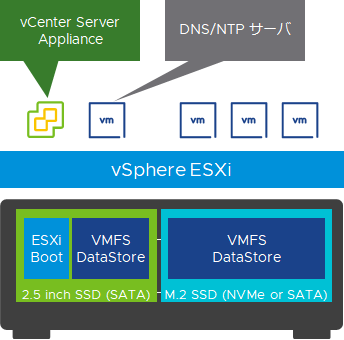

# おうちクラウド 第3回 "仮想化基盤を作ってみよう" サンプルコード・参考情報集

VMware Japan で vSAN HCI や Cloud foundation といったインフラ製品(仮想化基盤)のプロダクト SE をしている[川満](https://vexpert.vmware.com/directory/477)です。  
Twitter は本名のまま [@yuki_kawamitsu](https://twitter.com/yuki_kawamitsu) 、そのほかに個人ブログ**[「調べたこと 試したこと」](https://kwmtlog.blogspot.com/)**でも vSphere や vSAN 関連のネタを公開しています。

本コンテンツは執筆を担当した Software Design 誌 2022年 1月号 146頁 ~ 152頁 "はじめよう おうちクラウド" 第3回 "仮想化基盤を作ってみよう" の掲載内容を補足するサンプルスクリプト、参照先情報をまとめたものとなります。

そして勝手ながら、日本の VMware コミュニティのエキスパート、vExpert の皆さんで持ち回りで投稿しているアドベントカレンダー、**[vExperts Advent Calendar 2021](https://adventar.org/calendars/6689) の 12/24 のコンテンツ**も兼ねさせていただきました。  
年末年始、25本のディープなネタを一気に閲覧してみてください。

本記事では Intel NUC を使って自宅らぼを組んでみよう、vSphere をインストールしてみよう！という方向けの内容をご紹介します。

Software Design 誌 2022年 1月号に記した以下の流れに沿って、作業手順、サンプルスクリプトをご紹介します。

1. [NUCの初期設定](./01_nuc_setup.md)
2. [ESXiインストーラの作成](./02_esxi_custom_installer.md)
3. [ESXiのインストールと基本設定](./03_esxi_setup.md)
4. [vCenterのデプロイと基本設定](./04_vcenter_setup.md)
5. [Nested ESXiのデプロイ](./05_nested_esxi.md)
6. [vSphere Clusterの作成](./06_vsphere_cluster.md)

## [VMware DevOps Meetup #10](https://vmware.connpass.com/event/223160/) - (2021年9月22日開催)
今回まとめた内容は、Software Design 誌 2022年 1月号 の紙面情報の他、2021年9月に開催されたコミュニティイベントの登壇資料にもまとめておりますので併せて参照願います。

 * [自宅らぼ再入門　おうちクラウドのすすめ](https://www.slideshare.net/yukikawamitsu/20210922-250264836) - Intel NUC を利用して自宅で vSphere ESXi クラスタを導入するための考慮点を紹介。

## 今回の前提となる Intel NUC 構成

今回は最新の第11世代 Intel NUC "NUC11PAHi5" を利用しました。
※ 昨今の半導体の不足で 2021 年 12 月時点でかなり品薄状態の様です。

"NUC11PAHi5" は CPU は最初から搭載されていますが、ドライブとメモリは別途で対応製品を購入します。
2.5 inch の SATA ドライブと m.2 インターフェースの NVMe または SATA ドライブが搭載可能で、メモリは DDR4-3200 SO-DIMM を 2 枚搭載し最大 64GB までサポートされます。

購入する際に、本体には AC アダプタは付属していますが、その先のコンセントに接続する 3ピンコードは含まれないのでこれも併せて購入します。

また、vSphere ESXi をインストールする際や NUC の BIOS・Firmwear の更新時に USB メモリが必要となるので1つ用意します。2GB ~ 4 GB あれば十分です。

その他、Intel NUC を利用した vSphere 環境を構築する際にはネットワークスイッチや、作業用のモニタ、USB 接続のキーボードなども必要なので用意してください。

準備した NUC にこの後 vSphere ESXi をインストールしていきますが、今回は 2.5 inchの SSD に ESXi をインストールし、残りの領域と NMVe SSD を仮想マシンデータ (VMDK ファイル) を格納するデータストアとして利用します。

次へ **[NUCの初期設定](./01_nuc_setup.md)**