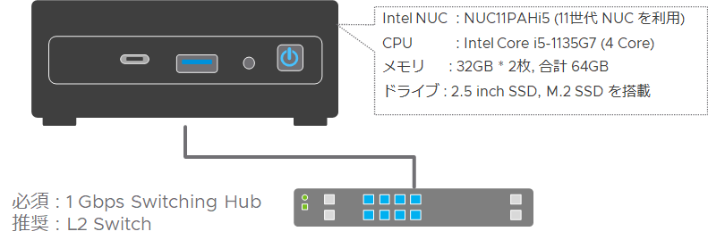
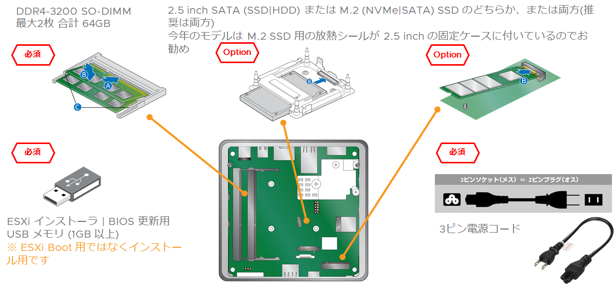
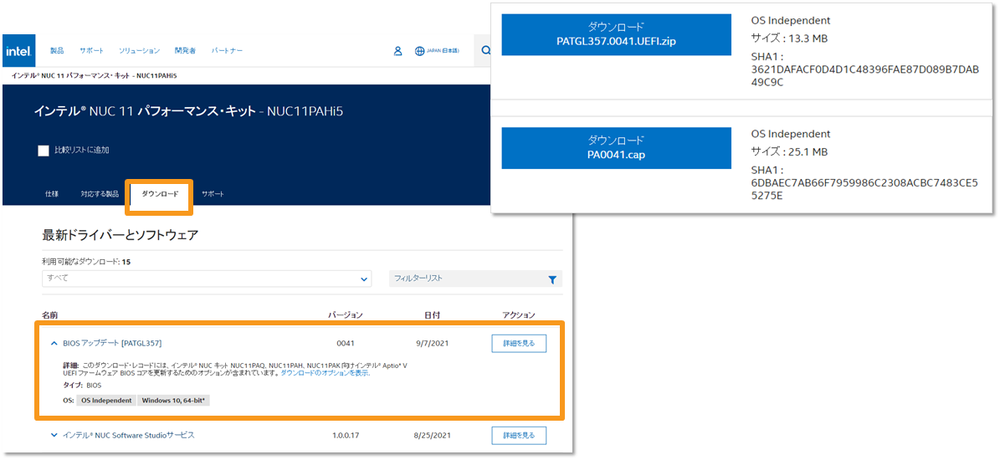

# おうちクラウド 第3回 "仮想化基盤を作ってみよう" サンプルコード・参考情報集

VMware Japan で vSAN HCI や Cloud foundation といったインフラ製品(仮想化基盤)のプロダクト SE をしている川満です。
本コンテンツは執筆を担当した Software Design 誌 2022年 1月号 146頁 ~ 152頁 "はじめよう おうちクラウド" 第3回 "仮想化基盤を作ってみよう" の掲載内容を補足するサンプルスクリプト、参照先情報をまとめたものとなります。

Intel NUC を使って自宅らぼを組んでみよう、vSphere をインストールしてみよう！という方向けの内容をご紹介します。

## 今回の前提となる Intel NUC 構成

今回は最新の第11世代 Intel NUC "NUC11PAHi5" を利用しました。
※ 昨今の半導体の不足で 2021 年 12 月時点でかなり品薄状態の様です。

"NUC11PAHi5" は CPU は最初から搭載されていますが、ドライブとメモリは別途で対応製品を購入します。
2.5 inch の SATA ドライブと m.2 インターフェースの NVMe または SATA ドライブが搭載可能で、メモリは DDR4-3200 SO-DIMM を 2 枚搭載し最大 64GB までサポートされます。




購入する際に、本体には AC アダプタは付属していますが、その先のコンセントに接続する 3ピンコードは含まれないのでこれも併せて購入します。

また、vSphere ESXi をインストールする際や NUC の BIOS・Firmwear の更新時に USB メモリが必要となるので1つ用意します。2GB ~ 4 GB あれば十分です。




その他、Intel NUC を利用した vSphere 環境を構築する際にはネットワークスイッチや、作業用のモニタ、USB 接続のキーボードなども必要なので用意してください。


準備した NUC にこの後 vSphere ESXi をインストールしていきますが、今回は 2.5 inchの SSD に ESXi をインストールし、残りの領域と NMVe SSD を仮想マシンデータ (VMDK ファイル) を格納するデータストアとして利用します。


Software Design 誌 2022年 1月号に記した以下の流れに沿って、作業手順、サンプルスクリプトをご紹介します。

1. NUCの初期設定
2. ESXiインストーラの作成
3. ESXiのインストール
4. vCenterのデプロイ
5. Nested ESXiのデプロイ
6. vSphere Clusterの作成


## NUC の初期設定

### BIOS 基本設定
NUC にメモリ、SSD 等を組み込みディスプレイとキーボードを接続して起動してみましょう。
起動直後に F2 キーを押下することで BIOS 設定メニューに入ります。

以下、実際の Intel 11th NUC の BIOS 設定画面からの情報を例に設定値をまとめています。

ESXi では NUC の "Audio"、"Microphone"、"WLAN (WirelessLAN)"、"Bluetooth"、"SD
Card" 等は利用しないので無効化します。

```
Advanced > Onboard Devices > HD Audio	: Disabled
Advanced > Onboard Devices > Audio DSP	: ☐
Advanced > Onboard Devices > Digital Microphone : ☐
Advanced > Onboard Devices > LAN		: Enabled
Advanced > Onboard Devices > Thunderbolt Support : Enabled
Advanced > Onboard Devices > WLAN		: ☐
Advanced > Onboard Devices > Bluetooth	: ☐
Advanced > Onboard Devices > Wireless Charging : ☐
Advanced > Onboard Devices > SDCard 3.0 Controller : ☐
Advanced > Onboard Devices > GNA		: ☐
Advanced > Onboard Devices > Enhanced Consumer IR : ☐
Advanced > Onboard Devices > HDMI CEC Control : ☐
Advanced > Onboard Devices > Boot NumLock State : Off
Advanced > Onboard Devices > Failsafe Watchdog : ☑

Cooling > Fan Control Mode		: Cool または Balanced
Cooling > Fan off capability		: ☑
```

また、CPU 設定などでは "Hyper-Threading"、"Intel Turbo Boost Technology"、仮想化支援機能の "Intel Virtualization Technology (Intel VT)"、 "Intel VT-d" などは vSphere ESXi として利用する際には必須・推奨な項目なので有効にします。

```
Performance > Processor > Hyper-Threading		: Enabled
Performance > Processor > Intel Turbo Boost Technology	: ☑
Performance > Processor > Active Processor Cores	: All
Performance > Processor > Debug Interface		: Disabled

Security > Security Features > Allow UEFI 3rd party driver loaded	: ☐
Security > Security Features > Intel Virtualization Technology	: Enabled
Security > Security Features > Intel VT for Directed I/O (VT-d)	: Enabled
Security > Security Features > Intel Platform Trust Technology	: ☐

Power > Max Performance Enabled			: ☑
Power > Intel Dynamic Power Technology		: Energy Efficient Perform
Power > Secondary Power Settings > After Power Failure	: Last State
Power > Secondary Power Settings > Wake on LAN from S4/S5	: Power On - Normal Boot

Boot > Secure Boot > Secure Boot 			: Disabled
```

これら設定で参考となる情報を vExpert の Florian さんが自身のブログにまとめてくださっているので併せてご参照ください。
[Intel NUC Recommended BIOS Settings for VMware ESXi](https://www.virten.net/2020/03/intel-nuc-recommended-bios-settings-for-vmware-esxi/)


### NUC BIOS Update

出荷状態の NUC は BIOS・Firmwear が古い状態で既知の不具合を含んでいる可能性が高いため、最新版がリリースされている場合は必ず更新しましょう。
今回利用している NUC11PAHi5 ならば [Intel のサポートサイト](https://via.vmw.com/EacX) から "BIOS アップデート" の ZIPファイルをダウンロード、含まれる拡張子 .cap ファイルを空の USB メモリなどにコピーします。
※ 必ずご利用のモデル名で Intel サポートサイトを検索して、適切なファイルをダウンロードして下さい。



NUC への更新ファイルの適用は NUC 起動直後に F7 キーを押下し、BIOS メンテナンスモードを起動、USB メモリにコピーした .cap ファイルを読み込ませて更新します。


## NUC 用の vSphere ESXi インストーラを作成する

### ESXi のダウンロード
VMware 製品の評価版ダウンロードは [製品評価センター](https://www.vmware.com/jp/try-vmware.html) から入手可能です。
※ 評価版と通常製品版に違いはありません。

ダウンロードには [VMware Customer Connect](https://customerconnect.vmware.com/) アカウントが必要なのでお持ちでない場合は新規に作成してください。

NUC 用には ISO ファイルで提供されている標準の ESXi インストーラでは NIC ドライバなど必要なものが不足しているので ESXi は Offline Bundle と記載のある ZIP ファイルをダウンロードします。

VMware 製品のダウンロードに慣れている人は[製品パッチ](https://customerconnect.vmware.com/jp/patch) から入手しても構いません。


### NUC 用のドライバの入手

VMware では [VMware Flings](https://flings.vmware.com) と呼ばれるサイトで検証ツール、製品化前のテスト段階のツールなどが公開されています。
特に、NUC のオンボード NIC のドライバはここで公開されているものを組み込むことが必須なので活用しましょう。
以下の3つのドライバは良く使われるので必要なものをダウンロードしましょう。


[Community Networking Driver for ESXi](https://flings.vmware.com/community-networking-driver-for-esxi)
- Intel NUC に搭載される NIC i225-V のドライバは標準の ESXi インストーラには含まれないため、Flings の NIC ドライバは必須のアイテム


[Community NVMe Driver for ESXi](https://flings.vmware.com/community-nvme-driver-for-esxi)
- ESXi に含まれる NVMe ドライバは市販の NVMe SSD はほとんど対応していないので、こちらのコミュニティドライバを利用。※ 私の環境では Transcend PCIe SSD 220S TS2TMTE220S の動作が確認できましたが、動作確認済みのものを Flings や Community で事前に確認してください。


[USB Network Native Driver for ESXi](https://flings.vmware.com/usb-network-native-driver-for-esxi)
- Intel NUC の標準 NIC 1port だけだと足りない、という方向けの USB NIC 用のドライバ。対応する ESXi のバージョンが限定的なため利用時には注意が必要。

※ Flings のツールはコミュニティツールであり公式非サポート故、特にバージョンアップ時などに不具合となる事が多々あります。不具合報告や解決のワークアラウンド含めてコミュニティで共有して改善につなげていただけると幸いです。


### NUC 用カスタムインストーラの作成

ダウンロードした ESXi の Offline Bundle と Flings のドライバを組み合わせて NUC 用のカスタムインストーラを作成します。

カスタムインストーラの作成には PowerShell 用 の PowerCLI Image Builder モジュールを利用します。
※ PowerCLI Image Builder は PowerShell Core では利用できないため、Windows OS で PowerShell 5.1 などにインストールした PowerCLI を利用します。

PowerCLI のインストールや、利用前の準備については私の過去の個人ブログにまとめてあるので以下を参照願います。

- [PowerShell Gallery からの PowerCLI インストール・アップデート方法](https://kwmtlog.blogspot.com/2018/03/powercli-10.html)
- [PowerShell 5.1 環境で PowerCLI のインストールエラーが出た時の対処方法（TLS バージョン問題での Install-Module や Register-PSRepository のエラー対応）](https://kwmtlog.blogspot.com/2020/05/powershell-51-PowerShellGallery-Error-2.html)
- [PowerCLIのセキュリティ警告を無視する設定](https://kwmtlog.blogspot.com/2018/03/Set-PowerCLIConfiguration.html)


#### カスタムインストーラ作成の流れ


#### PowerCLI Image builder を利用して NUC 用ドライバ入りのカスタムインストーラの作成

以下の例では C:\temp\ESXi フォルダに ESXi のバイナリと Flings から入手したドライバを格納しています。

※ 現在、vSphere 7.0u3 が既知のバグ問題と Log4j 脆弱性問題の対応で修正版が開発注となっております。修正版が提供され次第、最新バージョンでの手順に書き換える予定です。それまでは各ファイルのバージョンはご利用のものに読み替えてください。

```PowerShell
PS C:\temp\ESXi> dir
    ディレクトリ: C:\temp\ESXi
Mode                 LastWriteTime         Length Name
----                 -------------         ------ ----
-a----        2021/09/22     15:56         352447 ESXi702-VMKUSB-NIC-FLING-47140841-component-18150468.zip
-a----        2021/08/12     18:48         248817 Net-Community-Driver_1.2.0.0-1vmw.700.1.0.15843807_18028830.zip
-a----        2021/07/13     13:30          98340 nvme-community-driver_1.0.1.0-2vmw.700.1.0.15843807-component-18290856.zip
-a----        2021/09/22     15:47      580830285 VMware-ESXi-7.0U2c-18426014-depot.zip
```

##### Add-EsxSoftwareDepot で ESXi インストールイメージのインポート
```PowerShell
PS C:\temp\ESXi> Add-EsxSoftwareDepot -DepotUrl .\VMware-ESXi-7.0U2c-18426014-depot.zip
Depot Url
---------
zip:C:\temp\ESXi\VMware-ESXi-7.0U2c-18426014-depot.zip?index.xml
```

##### イメージプロファイルの取り込み
ESXi Offline Bundle には VMware Tools が含まれないイメージ、セキュリティアップデートのみが含まれるイメージなどいくつかパターンがあります。
-no-tools ではないもの、s や sc でないものを選びます。

```PowerShell
PS C:\temp\ESXi> Get-EsxImageProfile
Name                           Vendor          Last Modified   Acceptance Level
----                           ------          -------------   ----------------
ESXi-7.0U2c-18426014-no-tools  VMware, Inc.    2021/08/04 1... PartnerSupported
ESXi-7.0U2c-18426014-standard  VMware, Inc.    2021/08/24 0... PartnerSupported   ← これを使う
ESXi-7.0U2sc-18295176-no-tools VMware, Inc.    2021/07/09 1... PartnerSupported
ESXi-7.0U2sc-18295176-standard VMware, Inc.    2021/08/24 0... PartnerSupported

PS C:\temp\ESXi> $ip = (Get-EsxImageProfile)[1]
```

##### Flings ドライバの取り込み
```PowerShell
PS C:\temp\ESXi> Add-EsxSoftwareDepot -DepotUrl .\ESXi702-VMKUSB-NIC-FLING-47140841-component-18150468.zip
PS C:\temp\ESXi> Add-EsxSoftwareDepot -DepotUrl .\Net-Community-Driver_1.2.0.0-1vmw.700.1.0.15843807_18028830.zip
PS C:\temp\ESXi> Add-EsxSoftwareDepot -DepotUrl .\nvme-community-driver_1.0.1.0-2vmw.700.1.0.15843807-component-18290856.zip

```

##### Flings ドライバがあるか確認
取り込んだドライバの名称はそれぞれ、"net-community',"nvme-community","vmkusb-nic-fling" です。
```PowerShell
PS C:\temp\ESXi> Get-EsxSoftwarePackage |ft -AutoSize

Name                          Version                             Vendor Creation Date
----                          -------                             ------ -------------
nvme-community                1.0.1.0-2vmw.700.1.0.15843807       VMW    2019/07/02 3:07:57
net-community                 1.2.0.0-1vmw.700.1.0.15843807       VMW    2021/05/07 4:57:01
vmkusb-nic-fling              1.8-3vmw.702.0.20.47140841          VMW    2021/05/29 15:50:52
```

##### NUC 用にカスタムしたイメージプロファイルを作成
```PowerShell
PS C:\temp\ESXi> $ip2 = New-EsxImageProfile -CloneProfile $ip -Name Intel-NUC-7.0.u2c -Vendor kwmtlab -AcceptanceLevel CommunitySupported

Name                           Vendor          Last Modified   Acceptance Level
----                           ------          -------------   ----------------
Intel-NUC-7.0.u2c              kwmtlab         2021/08/24 0... CommunitySupported
```

##### Flings ドライバを NUC 用のイメージプロファイルに取り込む
```PowerShell
PS C:\temp\ESXi> Add-EsxSoftwarePackage -ImageProfile $ip2 -SoftwarePackage nvme-community,net-community, vmkusb-nic-fling

Name                           Vendor          Last Modified   Acceptance Level
----                           ------          -------------   ----------------
Intel-NUC-7.0.u2c              kwmtlab         2021/09/22 1... CommunitySupported
```

##### カスタムインストーラを ZIP と ISO でエクスポート

```PowerShell
PS C:\temp\ESXi> Export-EsxImageProfile -ImageProfile $ip2 -FilePath .\Intel-NUC-7.0.u2c.zip -ExportToBundle
PS C:\temp\ESXi> Export-EsxImageProfile -ImageProfile $ip2 -FilePath .\Intel-NUC-7.0.u2c.iso -ExportToIso

# ※ ZIP の Depot ファイルにしておけば後でもう一度このイメージを修正したいときに役立ちます
```


#### USB メモリにカスタムインストーラを展開
作成したカスタムインストーラ(ISOファイル)を USB メモリに展開してインストールメディアにします。
※ Unetbootin や Rufus  といったツールで作成できます。


##### オプション : システム領域サイズのカスタマイズ
USB に展開したインストーラの kickstart をカスタムして、初期設定の投入を自動化する事も可能です。
※ 詳細は William Lam さんの Blog 等を参照ください <https://williamlam.com/2019/07/automated-esxi-installation-to-usb-using-kickstart.html>

まず、カスタムインストーラを展開した USB メモリを PC にマウントし、USB:\BOOT.CFG と USB:\EFI\BOOT\BOOT.CFG を修正します。

```
bootstate=0
title=Loading ESXi installer
timeout=5
prefix=
kernel=/b.b00
kernelopt=runweasel cdromBoot   ← この行を消して
kernelopt=ks=usb:/KS.CFG systemMediaSize=min       ← kickstart の設定とシステム領域のサイズを追加 ※ 自宅らぼなら Boot 領域は Min 設定で OK
modules=/jumpstrt.gz --- /useropts.gz --- /features.gz --- /k.b00 --- /uc_intel.b00 --- /uc_amd.b00 --- build=7.0.2-0.20.18426014
updated=0
```

上記設定では kickstart と合わせて、ESXi のシステム領域のサイズを指定しています。
※ ESXi 7.0u1c から systemMediaSize Boot Option を指定する事でデフォルトのサイズを指定できる様になりました。設定なしだと OSData パーティション が最大 120 GB まで確保されてしま
自宅 Lab 用途などでブートドライブの VMFS 領域を有効に利用したい場合は以下オプションで適切なサイズでのインストールが可能です。(以下の GB 単位は GiB ではなく SI 接頭辞の GB)

- [Boot option to configure the size of ESXi system partitions (81166)](https://kb.vmware.com/s/article/81166)
- [ESXi 7.0 で利用可能な新しいカーネル オプション (77009)](https://kb.vmware.com/s/article/77009)

指定方法 : systemMediaSize=<size> 
- min (33 GB, for single disk or embedded servers)
- small (69 GB, for servers with at least 512 GB RAM)
- default (138 GB)
- max (consume all available space, for multi-terabyte servers)

インストール時のメディアで boot.cfg に kernelopt=runweasel systemMediaSize=small などとすることでサイズを指定することも可能です。

※ 公式サポートのない設定オプションで autoPartitionOSDataSize を利用して任意のサイズを指定する事も可能です。
その場合は autoPartitionOSDataSize=8192 等と設定をします。

##### オプション : kickstart ファイルの使用

kickstart ファイル "KS.CFG" を USB メモリの直下に保存 ※ 以下は今回のサンプルなので、適宜パスワードや IP アドレスの項を修正してください。

```
# Accept VMware EULA
vmaccepteula

# Root Password
rootpw Passw0rd!

# ESXi Install Drive / VMFS initialize  # NUC の SATA にインストール
install --firstdisk --overwritevmfs

# Static
network --bootproto=static --ip=192.168.11.123 --gateway=192.168.11.1 --netmask=255.255.255.0 --vlanid=0 --hostname=nuc103.kwmt.lab --nameserver=192.168.11.100 --addvmportgroup=1 --device=vmnic0

# Reboot
reboot

%firstboot --interpreter=busybox

# Enable Shell / SSH
vim-cmd hostsvc/enable_ssh
vim-cmd hostsvc/start_ssh
vim-cmd hostsvc/enable_esx_shell
vim-cmd hostsvc/start_esx_shell

# Disable Shell wWarning
esxcli system settings advanced set -o /UserVars/SuppressShellWarning -i 1

# Shell Timeout setting
esxcli system settings advanced set -o /UserVars/ESXiShellInteractiveTimeOut -i 3600

# Add NTP Server addresses
echo "server 192.168.11.100" >> /etc/ntp.conf;
echo "server 192.168.11.1" >> /etc/ntp.conf;
esxcfg-firewall -e ntpClient
/sbin/chkconfig ntpd on;

# Enable Nested ESXi
grep -i "vhv.enable" /etc/vmware/config || echo "vhv.enable = \"TRUE\"" >> /etc/vmware/config
esxcli system settings advanced set -o /VSAN/FakeSCSIReservations -i 1

# Disable CEIP
esxcli system settings advanced set -o /UserVars/HostClientCEIPOptIn -i 2

# Increase the network heap
esxcli system settings advanced set -o /Net/TcpipHeapMax -i 1024
```

## ESXi のインストール
インストールは特別な事はせず、作成した USB メモリのインストーラを NUC に挿して起動します。

インストーラが立ち上がらない時は NUC のブート画面で F10 を押して起動ディスクを指定してください。
後は kickstart が読み込まれて自動で設定されます。

kickstart を設定していない場合はウィザードに沿ってインストールデバイスの指定、パスワードの設定などを行ってください。

## ESXi の初期設定
kickstart がうまく走って初期設定が完了すれば、ESXi の FQDN 設定、パスワード含めて設定済みの環境が立ち上がります。
設定が反映されているか、ESXi のコンソール（黄色と黒の画面）にログインするか、


Web ブラウザで ESXi の IP アドレスを https://<ip address> で入力し Host Client に接続して確認します。


 -- 以降追記中 --

 